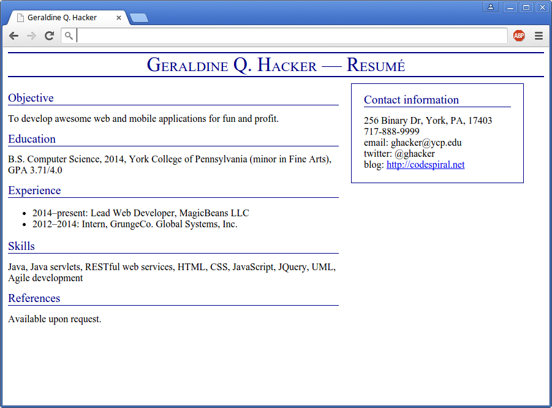

Your Task
=========

Use ChatGPT as a self-guided one-on-one assistant and tutor to help you create your own personal HTML/CSS resume.  The previous ChatGPT lab should have provided you with some insight into how to prompt ChatGPT for information.  You can instruct ChatGPT to manipulate its suggestions so that you can get it to produce the Resume format and contents specified below.

Use HTML and CSS and *ChatGPT 3.5** to create your resume, using the following example as a template (click for full-size).

> 

You can enter the following specifications into ChatGPT to have it assist you with the layout and format.  First, you should consider getting the proper layout of Divs, and then you can format and populate those Divs with your specific information.

Specifications
==============

Use **div** and **span** elements with **id** and **class** attributes to specify the body of the HTML document. All visual styling should be done separately in CSS rules.

The resume should have a title running across the top (with dark blue bars above and below).

The content area should be to the left and the sidebar (contact info) should be to the right.  The contact info sidebar **must** float left **under** the content area when the frame is too narrow to display both side-by-side.

The text in the page title should be rendered in small caps.

The page title and the text of section headers should be dark blue.

You **must** also create a second page that links to the first page of the resume.  On the second page of your resume include information about yourself that you would like to share with me, such as previous projects, outside interests, etc.  You must embed at least one picture, and you must link to a non-offensive YouTube video.  Include anything else on this page that relates to you.  Be creative.

You **must** use **separate HTML and CSS files** for you final submission.  You can look [here](https://www.w3schools.com/html/default.asp) under the HTML tutorial section to figure out how to do this.  That is your first self-learning requirement of the semester.  You will likely be referring to [w3Schools.com](http://www.w3schools.com) extensively throughout this course.

**NOTE:** I highly appreciate extra work on these labs.  Feel free to add more content than I am requiring - figure out how to embed multiple pictures, audio, and/or video into your HTML resume.

**NOTE:** You must work individually on this lab.  It is imperative that everyone on your team be able to develop web page layouts using HTML and CSS.  This **WILL** come up on the exam.

Hints
-----

On the first page, float the content and sidebar divs to the left so that they float **under** your main content.

Use **width** properties to set the widths of the content and sidebar divs. For example, I have

    width: 540px;

on my content div, and

    width: 240px;

on my sidebar div.

You can use an **unordered list** for the **Experience** section: something like

    <ul>
        <li>Item 1</li>
        <li>Item 2</li>
    </ul>

Use the **border** property to draw a solid border around the sidebar.

Use the **border-top** and **border-bottom** properties to draw the horizontal lines above and below the title.

You can use the tag

     

to end a line of text.

You will need to use margins to spread things out a bit. (For example, you should have some vertical space between resume sections.)

For additional information, I highly recommend this [great tutorial site for HTML, CSS, Java Script, SQL, PHP](http://www.w3schools.com).

Submitting
==========

When you are done, submit the lab to the Marmoset server using the method below.

From a web browser
------------------

Save all of your HTML/CSS Resume files (including any embedded pictures and other artifacts) to a ZIP file named **CS320_Lab01.zip**.  Make sure to preserve the file structure of your Resume.  I recommend ZIPping the folder (and its contents) that contains your HTML/CSS Resume,

Upload the saved ZIP file to the **Lab01** project under **CS320, Spring 2024** on the Marmoset server. The Marmoset server URL is:

> [https://cs.ycp.edu/marmoset/](https://cs.ycp.edu/marmoset/)