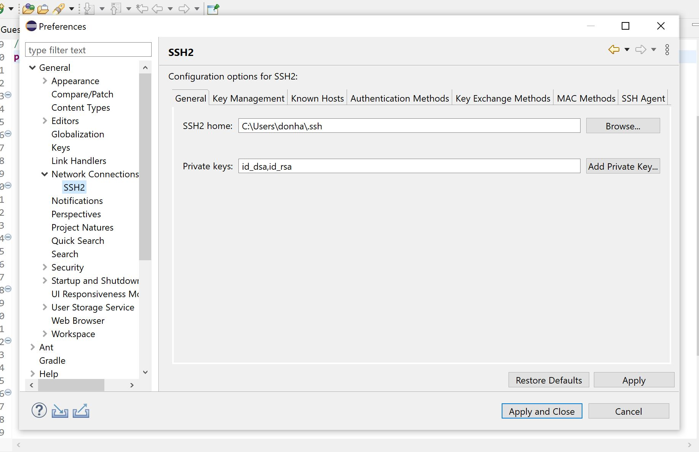

In this lab, you will be using [Git](http://git-scm.com/), which is currently the most widely used and arguably the best version control system.  It is also the version control system that is built into [GitHub](https://github.com), which is the website you wil be using to host the team remote code repositories, along with the GitHub issue tracker function.

In this course, you may also use [EGit](https://www.eclipse.org/egit/), which is the Git client software built into Eclipse.  This lab will familiarize you with using git and EGit.

You may also use use the [GitHub Desktop Client](https://desktop.github.com) or the [Git-Tower Desktop Client](https://git-tower.com), both of which facilitate easy(er) access and use of Git and are free to download and use.

## Before you start

Be aware of the following fact:

Git has a bit of a learning curve.

Ok, I'll admit I'm downplaying the learning curve a bit here.  You will probably find Git to be fairly confusing for a while.  Eventually, it will make sense.  I promise.

As with most worthwhile skills, becoming proficient with Git takes some work.  The best advice is to *think carefully* about what you're doing.

Another thing to keep in mind:

Git is one of the most awesome and powerful software development tools ever created.  Although it might take you a while to reach that conclusion - it could be years...

Like [OO Analysis](../lectures/lecture10.html), Git proficiency is a software development super power.

# Step 1: Create an SSH keypair

Here are GitHub's instructions for creating an SSH keypair to use with you GitHub account:

[How to Create and SSH key pair for GitHub](https://docs.github.com/en/authentication/connecting-to-github-with-ssh/generating-a-new-ssh-key-and-adding-it-to-the-ssh-agent)

KEC Lab Computer
-------------------

**If you are working from a KEC lab computer**, execute the following commands in a Windows 10/11 Command Window (enter "cmd" in the Windows search bar) or from Cygwin (Windows 7/10/11) or from a Linux terminal window.  Those instructions will take you to your **York College home (H:) drive**, and then will list the contents of the **.ssh** directory (if it already exists):

	cd h:
    ls .ssh

If the above commands show the files **id\_rsa** and **id\_rsa.pub**, you can skip the following steps, and proceed to Step 2, as you already have SSH keys.  Otherwise, execute the following command to create the .ssh folder:

    mkdir .ssh

Then execute the following command to generate the SSH key pair:

    ssh-keygen -t rsa -b 4096
    
You will want to save your SSH keypair to your **YCP Home Drive (H:)**.  When prompted to enter the file in which to save the keypair, enter the following path and file name for the SSH keypair, otherwise the keypair will be stored at **C:/Users/your-YCP-username/.ssh** on the KEC lab computer you are working on and will **NOT** be available to you when you work on other lab computers.  The path shown in parentheses is the default location - do **NOT** use the default location.  The second URL path is where you want to store the SSH keypair, **on your H: drive.

Windows 10/11:

    Generating public/private rsa key pair.
    Enter file in which to save the key (/home/your-YCP-username/.ssh/id_rsa): h:/.ssh/id_rsa

Windows Cygwin:

    Generating public/private rsa key pair.
    Enter file in which to save the key (/home/your-YCP-username/.ssh/id_rsa): /cygdrive/h/.ssh/id_rsa
	
When prompted for a passphrase, just press enter (twice).

That will store your SSH keys in the **.ssh** directory on your York College home drive **(H:/.ssh)**.

Now execute the following ccommand (which tells the Eclipse IDE where to find the SSH keypair):

    set Eclipse SSH2 home to H:/.ssh
    
Now skip to Step 2.

Your Own Computer
-------------------

**If you working from your own computer**, execute the following commands in a Windows 10/11 Command Window (enter "cmd" in the Windows search bar) or from Cygwin (Windows 7/10/11) or from a Linux terminal window.  Those instructions will take you to the drive you choose (for Windows, that would most likely be your **C:** drive), and then will list the contents of the **.ssh** directory (if it already exists):

	cd c:
    ls .ssh

If the above commands show the files **id\_rsa** and **id\_rsa.pub**, you can skip the following steps, and proceed to Step 2, as you already have SSH keys.  Otherwise, execute the following command to create the .ssh folder:

    mkdir .ssh
    
Then execute the following command to generate the SSH key pair:

    ssh-keygen -t rsa -b 4096
    
You will most likely want to save your SSH keypair to **your computer's root drive (C:)**.  When prompted to enter the file in which to save the keypair, enter the following path and file name for the SSH keypair, otherwise the keypair will be stored at **C:/Users/your-Windows-username/.ssh** on your computer.  That's fine, if that's where you want to store it.  The path shown in parentheses is the default location.  If you want to store the keypair somewhere else, i.e., on the root directory of your C: drive, then the second URL path is where you specify that location

Windows 10/11:

    Generating public/private rsa key pair.
    Enter file in which to save the key (/home/your-Windows-username/.ssh/id_rsa): c:/.ssh/id_rsa

Windows Cygwin:

    Generating public/private rsa key pair.
    Enter file in which to save the key (/home/your-Windows-username/.ssh/id_rsa): /cygdrive/c/.ssh/id_rsa

When prompted for a passphrase, just press enter (twice).

That will store your SSH keypair in the **.ssh** directory on your computer, at the location you specified, or the default location, if you did not specify a different location.

Now you need to tell Eclipse where to find your SSH keypair:

In Eclipse, open the **Window** tab, select **Preferences**, then **General**, then **Network Connections**, and finally **SSH**.  Or, more succinctly:

	Window->Preferences->General->Network Connections->SSH.

You should see this pop-up window (note that it is showing the current settings from Eclipse on my laptop):

> 

Now set your **SSH2 home** location and then select your **Private keys** from that location.  When you are done, select **Apply and Close**.

Alternately, you can do this directly in **Cygwin** by executing the following command, which fills in the same information in the Eclipse IDE as the above instructions do.  Adjust this command if you chose to save your SSH keypair somewhere other than your root C: drive):

    set Eclipse SSH2 home to C:/.ssh
    
# Step 2: Create a GitHub Account

If you don't already have a GitHub account, go to [GitHub](https://github.com).

Pick a username, enter a valid email address (I strongly suggest you use your YCP email address), and then select a password.

Select "Sign up for GitHub".

Choose the free service - that is the default.

Verify your email address.

# Step 3: Add your public key to your GitHub account

Log into [GitHub](https://github.com).

Click on the **Profile** icon in the top right of the page (it looks like a green square sitting on a green table.)

Click on **Settings** in the dropdown list.

Click on the **SSH and GPG keys** item about 1/3 down the left side, in the **Personal settings** column.

Click the **New SSH key** button at the top right of the SSH Keys list.

Enter "YCP" as the title.  In a text editor **Notepad++** or **Accessories &rarr; Text Editor**, open the file **.ssh/id\_rsa.pub**.  Copy the entire text in this file, and paste it into the **Key** textbox.  Then press the **Add SSH key** button.  You might need to enter the password for your GitHub account.

# Step 4: Fork

Go to the following GitHub repository page:

  [https://github.com/DonaldHakeII/MoveTheSquare](https://github.com/DonaldHakeII/MoveTheSquare)

Click "Clone or Download" and make sure that **Clone with SSH** is displayed for the clone credentials (just to the right of "Find file"). Click the **Fork** button (upper right button labelled "Fork" under the Profile icon).  This will make a clone of this repository in your own GitHub account.  This will be your personal public repository for this lab.

The repository you just forked contains an Eclipse project called **MoveTheSquare**, a game engine that will be the basis for the next great indie game.  You will just need to add some additional gameplay features!

**NOTE: You can stop after the conclusion of this step for Git Lab Part I.**  We will get back to it later in the semester in Git Lab Part II.  Feel free to move forward in this lab at your own pace.  EGit configuration is **NOT** required for CS320 - there are other methods for accessing Git and GitHub - see below.

# Step 5: Configure Eclipse

Now we will configure Eclipse to be able to directly access your GitHub repositories.  Most (if not all) modern IDEs have functionality that allows a team of developers to share and develop code directly from the IDE through a remote code repository.  Eclipse is one of those IDEs.  It can be confusing to get set up and to use it correctly.

You and your team  may also use the [GitHub Desktop Client](https://desktop.github.com) or the [Git-Tower Desktop Client](https://git-tower.com), both of which facilitate easy(er) access and use of Git version control in a team setting and are free to download and use.  They each operate separately from the IDE - so will require separate steps to manage the code in your repository AND develop and test the code in your IDE.  That's not necessarily a bad thing, at this stage in the course.

**Start Eclipse 2020-6**.  Choose **Window &rarr; Preferences &rarr;** to open the preferences dialog.

> Choose **General &rarr; Network Connections &rarr; SSH2**.  Make sure that **SSH2 home** is set to the drive and path that lead to your **/.ssh** folder (include **/.ssh** in the path). For lab PC's, this should be **H:/.ssh**.  Select OK when done.  Also verify that **Private keys** is set to the name of your private key file.  

Next, choose **Team &rarr; Git &rarr; Configuration**.  Use **Add Entry...** to create the following configuration entries:

> Key | Value
> ------- | -----
> user.email | *your email*
> user.name | *your name*
> core.autocrlf | true
> core.fileMode | false

**Note**: If you are developing on Linux or MacOS, it should be fine to set **core.fileMode** to **true**.

Use appropriate values for *your email* and *your name*. If you would prefer not to reveal your real name and email address, that's fine.

Also note the following:

First, make sure that you spell everything correctly.  Eclipse will **NOT** point out any "errors", since you are specifying these keys and values.  Then press **Apply**.

It is <i>extremely</i> important that you set the <b>core.autocrlf</b> setting to <b>true</b>.  If you do not do this, you will experience horrible problems when you try to synchronize your work with your teammates' work.  You will also incur my wrath.  Do not incur my wrath.

(If all of the members of your team are using Linux or MacOS, you will probably not need to worry about this.)

# Step 6: Clone your fork of the repository

In Eclipse, choose the **Git** perspective.  Click the "Clone a Git Repository and add the clone to this view" button (3rd button from left in the Git Repositories perspective).

In the GitHub web page for the repository fork you created in Step 4, click on "Move the Square" under "Your repositories".

In GitHub, select **SSH**, and then click the **"copy to clipboard"** button to the right of the SSH URL and paste it into the **URI** tab of the Eclipse **Clone Git Repository** dialog.

In Eclipse, click **Next** twice.

The **Local Destination** window will now appear in Eclipse.  You can choose where you want to store the local repository: if using your laptop, store it locally on your hard drive; if using a lab PC, store it on H:/ (your home drive).   After you have specified a storage location, click **Finish**.

Next, in Eclipse, choose the **Java** perspective.  Choose **File &rarr; Import... &rarr; Git &rarr; Projects from Git**, followed by **Existing local repository**.  Select the **MoveTheSquare** repository and click **Next**.  Click **Next** two more times, then click **Finish**.  You should now have a **MoveTheSquare** project in your Eclipse workspace that is connected to your public repository (the fork you created in Step 4).

To test that you can pull from your remote repository, right click on "Move the Square", and select **Team &rarr; Pull** and you'll get a message box titled "Pull Result for MoveTheSquare" that says that everything is up-to-date.

# Step 7: Make changes

You can run the program from **src &rarr; edu.ycp.cs320.movethesquare.ui**, right clicking on **GameView** and choosing **Run As &rarr; Java Application**.

Make some changes to the code:

* change the colors
* make the square bigger or smaller
* use a circle instead of a square
* make the square move faster
* prevent the square from moving outside the boundaries of the window

# Step 8: Commit and push your changes

Once you have made a change, right-click on the **Move The Square** project and choose **Team &rarr; Commit**.  Enter a log message describing your changes.  Select **Commit**.  This commits your changes to your local repository, but does not yet push (send) them to your remote repository at GitHub.

Next, right-click on **Move The Square** and choose **Team &rarr; Push** or **Team &rarr; Push Branch**.

A window for **Push to branch in remote** will appear.  You should see your comments displayed near the top, along with "master".  Select **Next**.  You will get the **Push Confirmation** window.  Select **Finish**.  If the push succeeds, you will see **Pushed to git@github.com:...**.  Select **OK**.

You should now be able to refresh your GitHub repository web pages and see the commit you just made.

In GitHub, if you click on "MoveTheSquare" you can explore and see all of the changes that have been made to the files in the project.  You can even view the code in GitHub. You will want to familiarize yourself with the GitHub interface for future use while developing our project.

# Step 9: Fetch and merge changes from other people

Refer to the [Fetch/Merge](../resources/fetchMerge.html) document for instructions on how to set up remote tracking branches to track the changes made by other people.

Find someone in the class whose changes you want to fetch and merge.

Using the Eclipse Git perspective, configure a *remote* for that person's public repository.  Then return to the Java perspective and fetch changes from the remote.  Finally, merge changes from the remote tracking branch containing the changes you fetched.

## Merge conflicts

If a merge does not cause any conflicts &mdash; meaning that the changes you merged did not make edits to any parts of the code that you edited in your changes &mdash; the merge succeeds and the result of the merge is committed to your private repository.

If the merge does cause conflicts, Eclipse will notify you and place a red conflict icon on all directories and files where conflicts occurred.  Eclipse will also add *conflict markers* in the source code to show you precisely where conflicts occurred, and to indicate what the conflicting text in each conflicting change was.  You will need to edit the code to remove the conflict markers and resolve the markers.

Once you have resolved a conflict, right-click on the file and choose **Team &rarr; Add** to indicate that the contents of the file have been restored to a consistent state.

Once all conflicts are resolved, you can commit the result of the merge.

Resolving merge conflicts is the most difficult part of using version control.  <b>Be careful</b> not to arbitrarily remove anyone else's code when you resolve a merge conflict.  If you are not sure what to do when a merge conflict occurs, <b>ask me for help</b>.

If you see a merge conflict where a conflict marker shows a conflict between two identical or nearly-identical versions of the entire file, it means that you or someone you fetched changes from did not set the **core.autocrlf** property to **true**.  If that happens,

<i>Prepare to experience my wrath!</i>

(Again, if no one on your team is using Windows, you will probably not need to worry about this.)

## Pushing following a merge

Once a merge has been completed, you should do a push so that your public repository is updated with the results of the merge.

<!-- vim:set wrap: ­-->
<!-- vim:set linebreak: -->
<!-- vim:set nolist: -->
